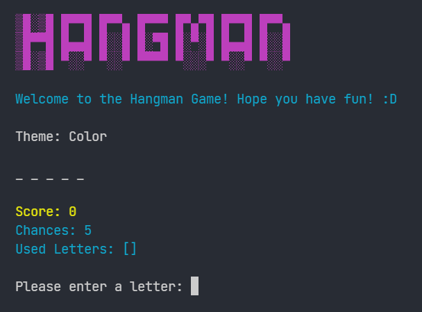
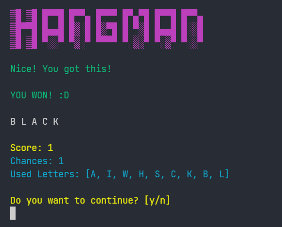
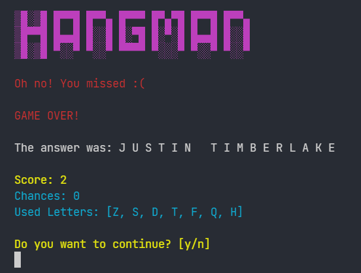

<div align="center">


# Hangman - Java Console Game


</div>

> Jogo da Forca (Hangman) desenvolvido em Java para atender os requisitos da disciplina de Estrutura de Dados, lecionada pelo profº Peter Jandl - FATEC Jundiaí 🚀

## 💻 Sobre o Projeto

Este é um simples Jogo da Forca. O jogo buscará uma palavra e seu tema para que você possa acertá-la, dando palpites de letras.

O jogador possui 5 tentativas. Se conseguir acertar a palavra, faz 1 ponto.

## 🕹️ Como Rodar

Assumindo que você tenha instalado Git e JDK11 ou superior, clone este repositório para sua máquina local através do seguinte comando:

```git
git clone https://github.com/dannesx/Hangman.git
```

Para executar o projeto no seu terminal, execute o comando:

```git
java -jar Hangman.jar
```

Divirta-se! 😀

## 📑 Requisitos do Projeto

Os requisitos da atividade era desenvolver um jogo em Java para console, sem interface gráfica, com a implementação de pelo menos duas Estruturas de Dados mencionadas durante o semestre.

Para este jogo, utilizei as estruturas Tabela de Espalhamento _(HashMap)_ e Listas _(ArrayList)_

São utilizadas na classe `Words.java` para adicionar uma lista de palavras relacionadas à certo tema.

## 🖼️ Telas

<div align="center">







</div>

## 📚 Licença

Este projeto possui licença MIT. Você está livre para utilizá-lo a fins de estudo e projetos pessoais!

## 😀 Agradecimentos

Gostaria de agradecer ao excelentíssimo professor Peter Jandl, que me inspira a extrair o melhor de minhas habilidades, e que fez uma grande diferença na minha vida acadêmica/profissional!
